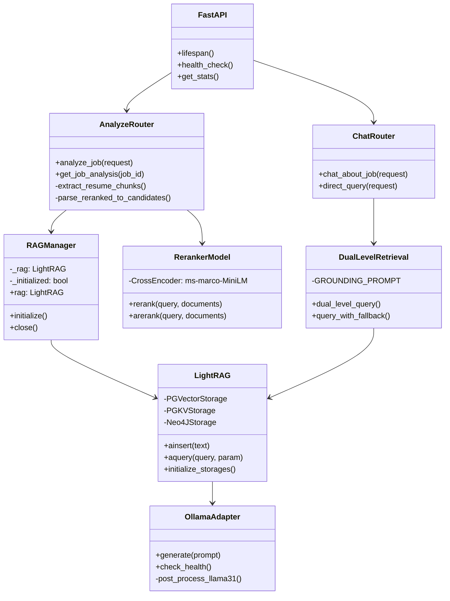
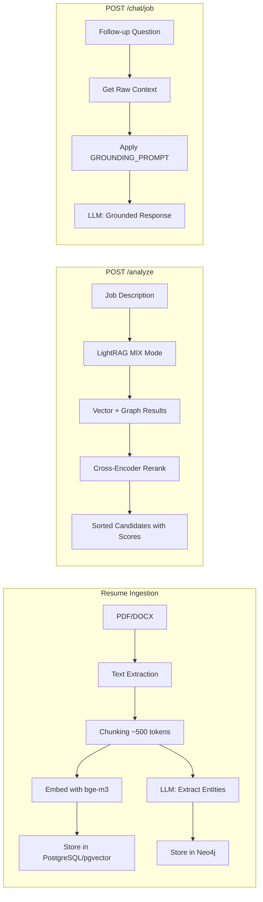

# LightRAG ATS - System Architecture

## 🧠 Core Techniques & Algorithms

### Stage 1: Resume Ingestion

| Step                    | Technique             | Implementation                                          |
| ----------------------- | --------------------- | ------------------------------------------------------- |
| **Text Extraction**     | Rule-based parsing    | `PyMuPDF` (PDF), `python-docx` (DOCX)                   |
| **Chunking**            | Token-based splitting | Split at ~500 tokens with 50 overlap                    |
| **Embedding**           | Dense Vector Encoding | `BAAI/bge-m3` → 1024-dimensional vectors                |
| **Entity Extraction**   | LLM Prompting         | Ollama `llama3.1:8b` extracts: skills, roles, companies |
| **Relation Extraction** | LLM Prompting         | "Person → WORKED_AT → Company" triples                  |
| **Vector Storage**      | PostgreSQL + pgvector | HNSW index for fast similarity search                   |
| **Graph Storage**       | Neo4j                 | Knowledge graph with entities and relationships         |

---

### Stage 2: Candidate Filtering (`/analyze`)

```
┌─────────────────────────────────────────────────────────────────┐
│                  IMPROVED CANDIDATE RANKING                      │
├─────────────────────────────────────────────────────────────────┤
│                                                                  │
│  1. Job Description → LightRAG MIX Mode                         │
│     ↓                                                            │
│  2. Vector Search (pgvector) + Knowledge Graph (Neo4j)          │
│     ↓                                                            │
│  3. Extract resume chunks from context                          │
│     ↓                                                            │
│  4. Cross-Encoder Reranker (ms-marco-MiniLM-L-6-v2)             │
│     ↓                                                            │
│  5. Return candidates with REAL relevance scores                │
│                                                                  │
└─────────────────────────────────────────────────────────────────┘
```

**Key Improvement:** Candidates are now sorted by **actual cross-encoder similarity scores** between JD and resume, not by position in results.

---

### Stage 3: Chat Query (`/chat/job` and `/chat/query`)

```
┌─────────────────────────────────────────────────────────────────┐
│            GROUNDED RETRIEVAL-AUGMENTED GENERATION               │
├─────────────────────────────────────────────────────────────────┤
│                                                                  │
│  1. Get raw context (only_need_context=True)                    │
│     ↓                                                            │
│  2. Apply GROUNDING_PROMPT to prevent hallucination             │
│     ↓                                                            │
│  3. LLM generates response using ONLY provided context          │
│                                                                  │
│  Retrieval Modes:                                                │
│  • naive  → Vector search only (fastest)                        │
│  • local  → Entity-specific from Knowledge Graph                │
│  • global → Relationship patterns from KG                       │
│  • hybrid → local + global combined                             │
│  • mix    → Vector + Graph (recommended)                       │
│                                                                  │
└─────────────────────────────────────────────────────────────────┘
```

**Anti-Hallucination:** The `GROUNDING_PROMPT` explicitly instructs the LLM to:

- Answer ONLY using provided resume data
- NOT talk about its training or capabilities
- Quote specific candidates and skills from context

---

### Stage 4: Response Generation

```
┌─────────────────────────────────────────────────────────────────┐
│                    LLM RESPONSE GENERATION                       │
├─────────────────────────────────────────────────────────────────┤
│                                                                  │
│  Model: Ollama llama3.1:8b (8 billion parameters)               │
│  Type: Instruction-tuned decoder-only transformer               │
│                                                                  │
│  Prompt Structure (Grounded):                                    │
│  ┌───────────────────────────────────────────────────────────┐  │
│  │ You are an ATS assistant answering questions about        │  │
│  │ candidate resumes.                                         │  │
│  │                                                            │  │
│  │ ⚠️ CRITICAL RULES:                                        │  │
│  │ 1. Answer ONLY using RESUME DATA below                    │  │
│  │ 2. DO NOT talk about yourself or your training            │  │
│  │                                                            │  │
│  │ RESUME DATA: [Retrieved chunks + KG entities]             │  │
│  │                                                            │  │
│  │ USER QUESTION: {query}                                     │  │
│  └───────────────────────────────────────────────────────────┘  │
│                                                                  │
└─────────────────────────────────────────────────────────────────┘
```

---

## System Architecture

```
├── api/                          # FastAPI Application Layer
│   ├── main.py                   # App entry, lifespan, health endpoints
│   ├── models.py                 # Pydantic request/response models
│   ├── middleware.py             # Logging, error handling
│   └── routes/
│       ├── analyze.py            # POST /analyze - candidate ranking with reranker
│       ├── chat.py               # POST /chat/* - grounded RAG queries
│       └── ingest.py             # POST /ingest - resume upload
│
├── src/                          # Core Business Logic
│   ├── config.py                 # Settings from .env
│   ├── rag_config.py             # LightRAG initialization with PostgreSQL/Neo4j
│   ├── llm_adapter.py            # Ollama API wrapper with Qwen/Llama fixes
│   ├── embedding.py              # BAAI/bge-m3 embeddings (GPU-accelerated)
│   ├── ingestion.py              # Resume processing pipeline
│   ├── resume_parser.py          # PDF/DOCX/TXT extraction
│   ├── dual_retrieval.py         # Vector + Graph retrieval with grounding
│   ├── reranker.py               # Cross-encoder reranking (ms-marco-MiniLM)
│   └── prompts.py                # ATS-specific prompts for entity extraction
│
├── scripts/                      # CLI Tools
│   ├── ingest_resumes.py         # Batch ingestion
│   ├── init_db.py                # Database initialization
│   ├── reset_db.py               # Database reset
│   └── test_retrieval.py         # Retrieval testing
│
└── docker-compose.yml            # PostgreSQL with pgvector
```

---

## Component Diagram



---

## Data Flow



---

## Storage Architecture

| Components         | Technology                                                 | Purpose                              |
| ------------------ | ---------------------------------------------------------- | ------------------------------------ |
| **Backbone LLM**   | Ollama `llama3.1:8b` (optimized for instruction following) | LLM for generation and extraction    |
| **Vector Storage** | PostgreSQL + pgvector                                      | Resume chunk embeddings (HNSW index) |
| **KV Storage**     | PostgreSQL                                                 | Full documents, text chunks, cache   |
| **Graph Storage**  | Neo4j                                                      | Knowledge graph (entities/relations) |
| **Doc Status**     | PostgreSQL                                                 | Ingestion tracking                   |

---

## Request Processing

### POST /analyze (Candidate Ranking)

```
Request: {job_description, top_k}
    ↓
LightRAG.aquery(mode="mix", only_need_context=True)
    ↓
PostgreSQL: Vector search (pgvector)
Neo4j: Knowledge graph entities/relations
    ↓
Extract resume chunks from context
    ↓
Cross-Encoder Reranker: Score each chunk vs JD
    ↓
Parse candidates with REAL relevance scores
    ↓
Store context for chat phase
    ↓
Response: [{name: "...", score: 0.847, highlights: [...]}]
```

### POST /chat/job (Grounded Chat)

```
Request: {job_id, message}
    ↓
Get stored job context (candidates from /analyze)
    ↓
LightRAG.aquery(only_need_context=True)  ← Get raw chunks
    ↓
Apply GROUNDING_PROMPT + raw_context + query
    ↓
LLM generates response ONLY from provided context
    ↓
Response: {response: "Based on the resume data, ...", mode_used: "naive (grounded)"}
```

---

## Key Configuration

| Setting            | Value                           | Description                   |
| ------------------ | ------------------------------- | ----------------------------- |
| `llm_model`        | `llama3.1:8b`                   | LLM for generation/extraction |
| `embedding_model`  | `BAAI/bge-m3`                   | 1024-dim dense vectors        |
| `rerank_model`     | `cross-encoder/ms-marco-MiniLM` | JD-resume similarity scoring  |
| `chunk_token_size` | 500                             | Tokens per chunk              |
| `chunk_overlap`    | 50                              | Overlap between chunks        |
| `vector_storage`   | `PGVectorStorage`               | PostgreSQL with pgvector      |
| `graph_storage`    | `Neo4JStorage`                  | Neo4j for knowledge graph     |

---

## Future Enhancements (Production Roadmap)

See [PRODUCTION_ROADMAP.md](./PRODUCTION_ROADMAP.md) for detailed implementation plans.

| Phase  | Enhancement                       | Priority | Status  |
| ------ | --------------------------------- | -------- | ------- |
| **P0** | Reranking Cap (max 50 candidates) | Critical | ✅ Done |
| **P1** | Hybrid Search (BM25 + Vector)     | High     | ✅ Done |
| **P2** | Entity Resolution & Ontology      | Medium   | ✅ Done |
| **P3** | Event-Driven Ingestion (Celery)   | High     | Planned |

### Implemented Optimizations

- **Reranking Cap**: Limited to 50 candidates to prevent O(N) performance issues
- **Grounding Prompt**: Prevents LLM hallucination
- **Cross-Encoder Scoring**: Real JD-resume relevance scores
- **Hybrid Search**: BM25 (30%) + Vector (50%) + Graph (20%) scoring
- **Entity Resolution**: 250+ canonical skills with RapidFuzz matching

### Planned Optimizations

- **ColBERT v2**: Near-vector-speed with cross-encoder accuracy
- **Task Queue**: Async ingestion with Celery + Redis
