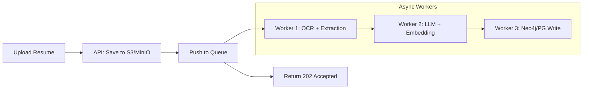

# ATS Production Roadmap

## Current Status: Functional Prototype ✅

## Target: Enterprise-Ready System

---

## Phase 1: Event-Driven Ingestion

### Current Issue

Direct HTTP POST `/ingest` times out with heavy PDF parsing or LLM extraction.

### Solution: Task Queue Architecture



### Implementation

| Component    | Technology      | Purpose              |
| ------------ | --------------- | -------------------- |
| Queue        | Celery + Redis  | Task distribution    |
| Storage      | MinIO/S3        | File storage         |
| OCR Fallback | DocTR/Tesseract | Complex PDF handling |

---

## Phase 2: Hybrid Search (BM25 + Vector)

### Current Issue

Vector search can't distinguish "Java" from "JavaScript" or find exact certifications like "CPA".

### Solution: Sparse + Dense Search

```python
# Hybrid query combining:
# 1. BM25 keyword match (exact terms)
# 2. Vector similarity (semantic meaning)
# 3. Graph constraints (hard filters)

hybrid_results = (
    bm25_score * 0.3 +      # Keyword match
    vector_score * 0.5 +     # Semantic similarity
    graph_bonus * 0.2        # Has required skills
)
```

### Implementation Options

- pgvector sparse vectors
- Neo4j full-text index + graph constraints
- Elasticsearch as secondary index

---

## Phase 3: Graph Schema & Entity Resolution

### Current Issue

LLM creates messy entities: "Google", "Google Inc.", "Google, LLC" as separate nodes.

### Solution: Strict Ontology + Normalization

**Fixed Relationship Types:**

```
HAS_SKILL, WORKED_AT, HAS_ROLE, LOCATED_IN,
HAS_CERTIFICATION, WORKED_WITH, HAS_EDUCATION
```

**Entity Normalization Pipeline:**

```
Raw Entity → Fuzzy Match → Canonical Entity
"ReactJS"  →    match   → "SKILL:React"
"React.js" →    match   → "SKILL:React"
```

### Implementation

- Skills/Companies canonical list
- Fuzzy matching (rapidfuzz)
- Pre-write validation layer

---

## Phase 4: Reranking Optimization

### Current Issue

Cross-encoder is O(N) - ranking 100+ candidates kills performance.

### Solution: Two-Stage Reranking + ColBERT

| Stage | Technique     | Candidates | Latency |
| ----- | ------------- | ---------- | ------- |
| 1     | Vector search | 1000 → 50  | ~10ms   |
| 2     | Cross-encoder | 50 → 10    | ~200ms  |

**OR**

| Alternative | Model           | Accuracy | Speed |
| ----------- | --------------- | -------- | ----- |
| Current     | ms-marco-MiniLM | High     | Slow  |
| **Upgrade** | ColBERT v2      | High     | Fast  |

---

## Priority Order

| Phase                      | Effort | Impact | Priority |
| -------------------------- | ------ | ------ | -------- |
| Phase 4: Reranking Cap     | Low    | High   | **P0**   |
| Phase 2: Hybrid Search     | Medium | High   | **P1**   |
| Phase 3: Entity Resolution | Medium | Medium | **P2**   |
| Phase 1: Event-Driven      | High   | High   | **P3**   |
