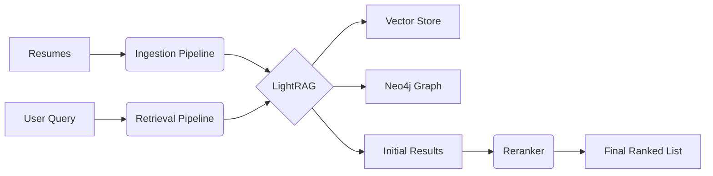

# System Architecture

This document outlines the technical design of the LightRAG ATS.

## High-Level Overview

The system operates in two main phases: **Ingestion** and **Retrieval**.

## 1. Ingestion Pipeline

The ingestion process transforms raw text resumes into structured knowledge.

1.  **Parsing**: Resumes are read from the `resumes/` directory.
2.  **Chunking**: Text is split into manageable chunks (e.g., 1200 tokens) with overlap.
3.  **Embedding**:
    *   Model: `BAAI/bge-m3`
    *   Each chunk is converted into a 1024-dimensional vector.
    *   Vectors are stored in a local FAISS index (`rag_storage/`).
4.  **Graph Construction**:
    *   LightRAG uses the LLM to extract entities (Candidates, Skills, Companies, Schools) and relationships (HAS_SKILL, WORKED_AT).
    *   These are stored in **Neo4j**.

## 2. Retrieval Pipeline

The retrieval process finds the most relevant candidates for a given query.

1.  **Query Processing**: The user's query is analyzed to extract keywords.
2.  **Hybrid Search**:
    *   **Vector Search**: Finds chunks semantically similar to the query.
    *   **Graph Traversal**: Finds entities related to the query terms (e.g., "Python" -> related skills).
3.  **Aggregation**: Results from vector and graph searches are combined.
4.  **Reranking**:
    *   Model: `BAAI/bge-reranker-v2-m3`
    *   The top `N` results are scored against the query using a Cross-Encoder.
    *   This step significantly reduces false positives.
5.  **Response Generation** (Optional):
    *   The LLM can generate a summary or answer based on the retrieved context.

## Key Components

### `src/rag_engine.py`
The central controller. It initializes `LightRAG` with the specific embedding and reranking functions defined in the project. It manages the connection to Neo4j and the vector store.

### `src/embeddings.py`
Wrapper for the `sentence-transformers` library to generate embeddings locally. It ensures compatibility with LightRAG's expected interface.

### `src/rerank.py`
Implements the reranking logic. It takes a list of retrieved nodes and a query, scores them using the Cross-Encoder model, and returns the sorted list.

### `src/config.py`
Central configuration file for model names, paths, and API keys.
